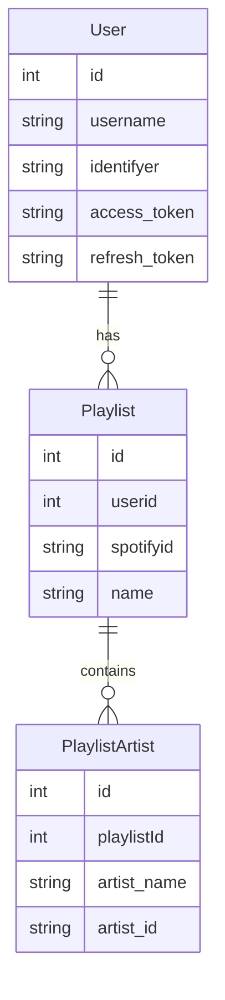

# Ideas

<!--toc:start-->
- [Ideas](#ideas)
  - [Expectations](#expectations)
  - [What do i need?](#what-do-i-need)
    - [Database](#database)
    - [Web service](#web-service)
    - [Update service](#update-service)
<!--toc:end-->

## Expectations

- The basic idea is to have a service which creates and maintains playlist which
  contain a all songs of one or more artists.
- You should be able to login with you Spotify account.
- You should be able to tell the service to create a new playlist and select the
  artists you want to listen to.
- The service should periodically update every playlist by checking getting all
  the tracks of the associated artists and update if necessary
- You should be able to manually trigger an update of a playlist
- You should be able to add or remove artists from a playlist

## What do i need?

### Database

### Web service

The Web service will handle all the user interaction.
The logged in user should be able to create / update / remove his playlists.

### Update service

  The update service will be a responsible for updating the playlists periodically
